# 分支的基础操作

## 分支的基础操作

1.    查看本地分支```git branch```

      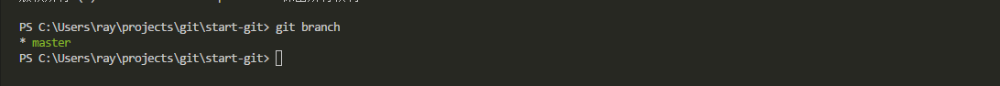

        绿色表示当前分支

1.    新建分支```git branch dev```

1.    再次查看本地分支```git branch```

      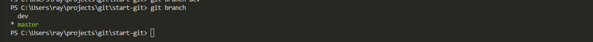

1.    切换分支```git checkout dev```

1.    查看本地分支```git branch```

      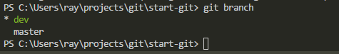

        > dev是绿色的，表示当前分支为dev

1.    修改或增加本分支文件。例如：增加一个文件```dev-branch.md```

1.    查看 dev 分支状态```git status```

      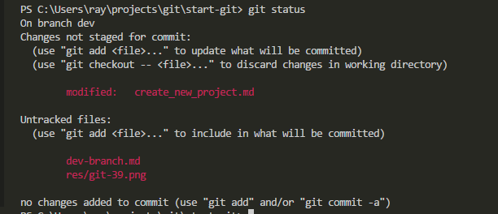

1.    将新建的文件加入到当前分支的暂存区```git add -A```

1.    将暂存区更新提交到本地版本库```git commit -m "新建分支"```

1.    将本地分支推送到远程库```git push origin dev```

      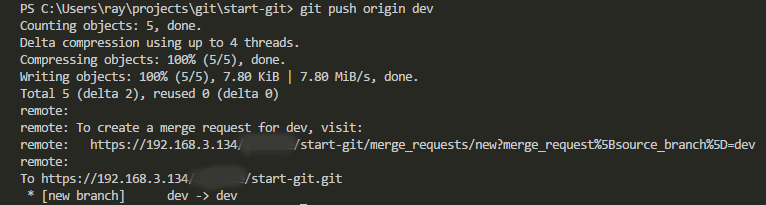

1.    打开gitlab网站如下图所示

      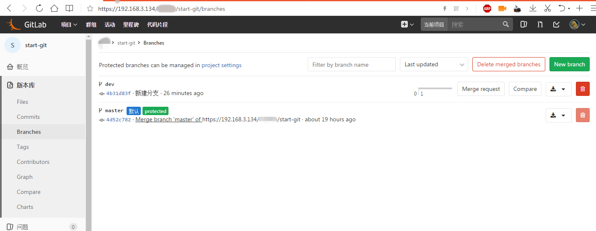

1.   修改dev分支下的```dev-branch.md```文件

      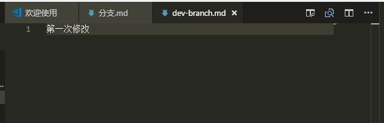

1.   将修改提交到远程库

        ```bash
        git add -A
        git commit -m "dev 第一次修改"
        git push origin dev
        ```

1.    切回 master 分支 ```git checkout master``` 结果如下图

      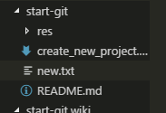

        > dev 分支下的 dev-branch.md 文件因为不在master分支下，所以切换之后就看不见了。

1.    在master分支下新建一个```master-branch.md``` 文件并提交到远程库的master分支。

      ```bash
      git add -A
      git commit -m "新建master-branch.md文件"
      git push origin master
      ```

1.    打开GitLab网页，可以看到下图蓝色框部分。

      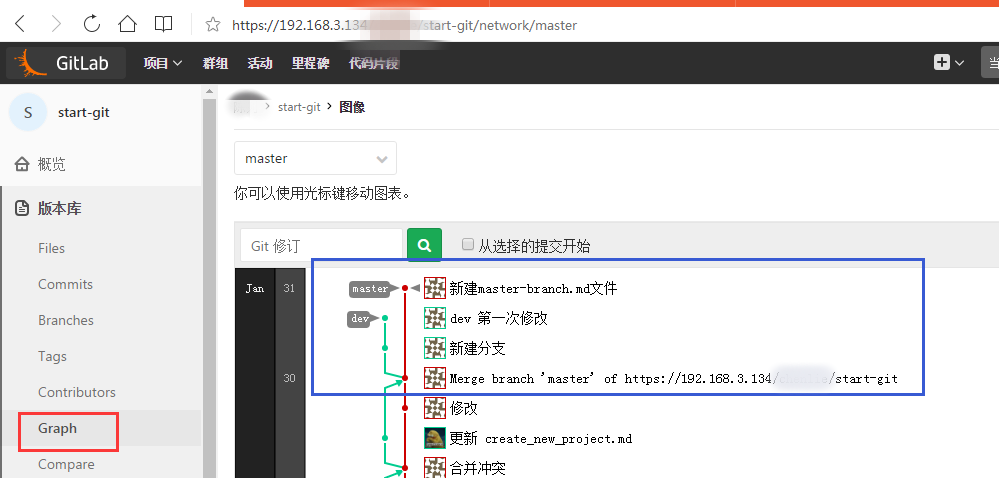

      > 可以通过GitLab提供的工具看到，已经将本地的两个分支分别提交到了远程库。

1.    切换本地分支到 dev ```git checkout dev```

1.    检查当前分支的文件，可以看到 dev-branch.md 文件回来了，而master-brandh.md 文件因为不属于 dev 分支而在工作区消失了。

      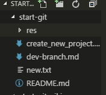

1.    查看当前分支的状态 ```git status```

      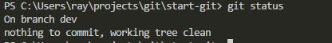

1.    继续修改当前分支的 dev-branch.md 文件，并且提交修改到远程dev分支

      ```bash
      git add -u
      git commit -m "dev 第二次修改"
      git push origin dev
      ```

1.    查看 GitLab 上分支图，显示如下

      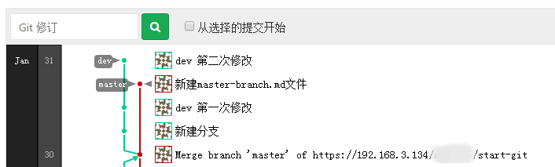

## 合并分支

顺利完成上一小节操作之后，假设 dev 分支的第二次修改表示当前阶段的开发已经完成。那么需要将 dev 分支合并到 master 分支以推进 master 的更新。merge(合并) 操作可以在本地，也可以在 GitLab 网站完成。这里演示使用 GitLab 网站对 dev 和 master 分支进行合并。

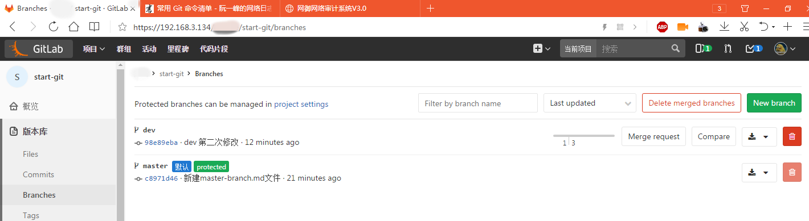

点击上图 dev 分支的 Merge request，发起合并分支请求

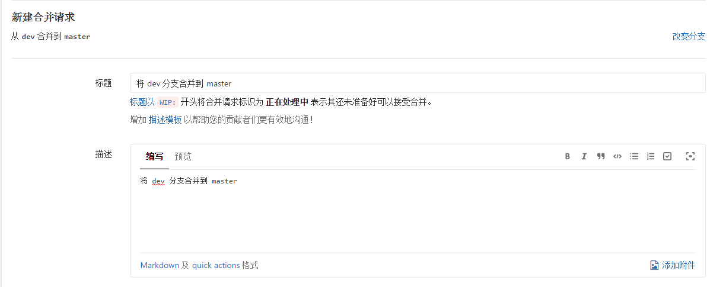

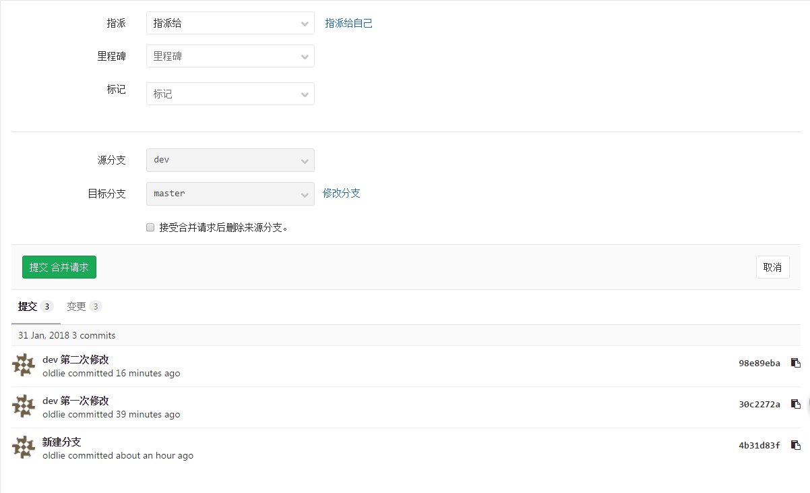

点击上图的 提交合并请求

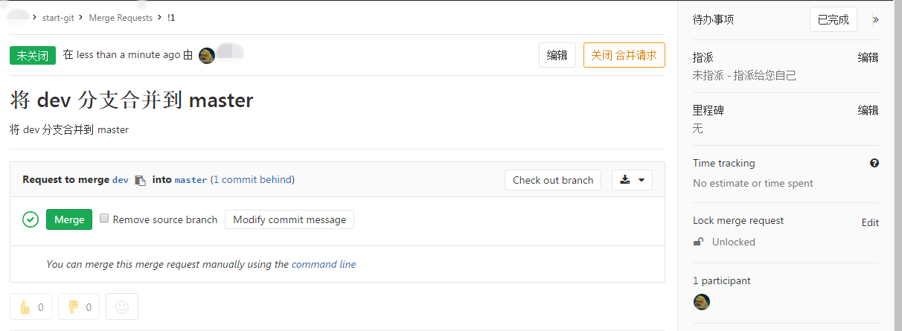

点击上图的 Merge

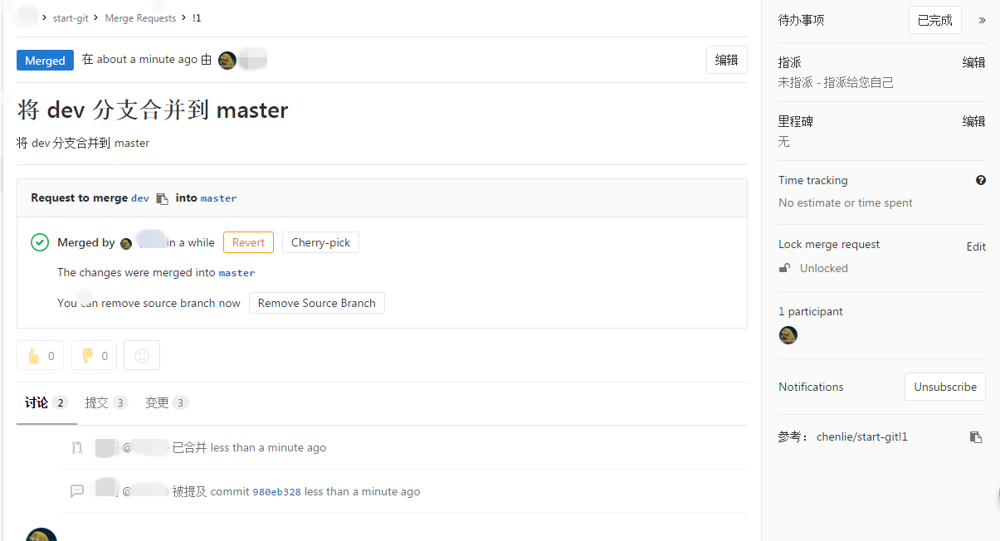

打开 GitLab 分支图网页，可以看到 dev上的修改已经合并到了 master中

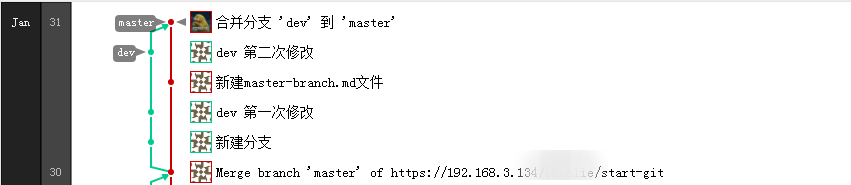

提示 dev 分支的代码已经合并到了 master。将本地的分支切换到 master，并且将远程库master分支的修改拉取到本地。

```bash
git checkout master
git pull origin master
```

检查工作区文件夹，可以看到 dev 分支的修改已经在master分支中显示了

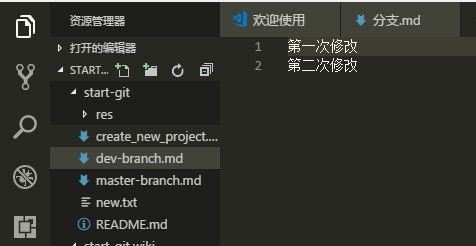

将工作区分支切换到 dev ```dev```

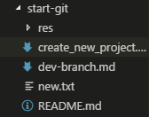

> 因为是 dev 的commit合并到master所以可以看，本地工作区 dev 分支下并没有 master 上提交的文件 master-branch.md

修改 dev-branch.md 文件内容

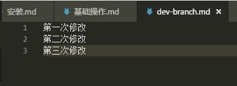

提交上图的修改

```bash
git add -u
git commit -m "dev 第三次修改"
git push origin dev
```

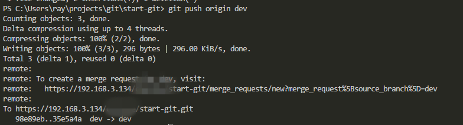

打开GitLab网站可以看分支图，可以看到dev分支和master分支已经分别演进了。

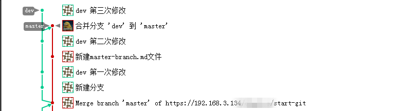

## 将主分支特定的 commit 合并到 dev 分支

本地工作区切换到 master 分支```git checkout master```

修改 master-branch.md 文件内容

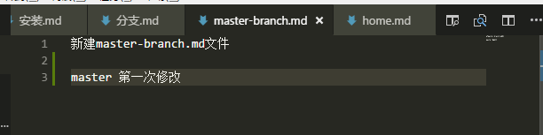

提交本次修改到远程库

```bash
git add -u
git commit -m "master 第一次修改"
git push origin master
```

检查 GitLab 的分支图

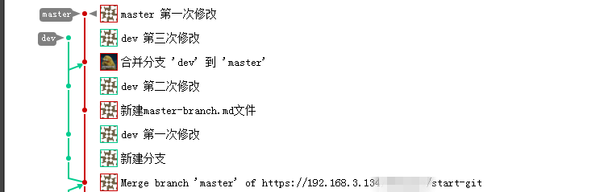

切换本地工作区分支到 dev ```git checkout dev```

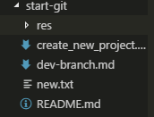

可以看到没有 master-branch.md 文件

在 GitLab 分支图上点击 “新建master-branch.md文件” 这个 “commit” 

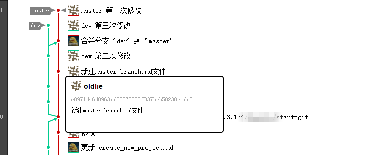

弹出如图所示网页

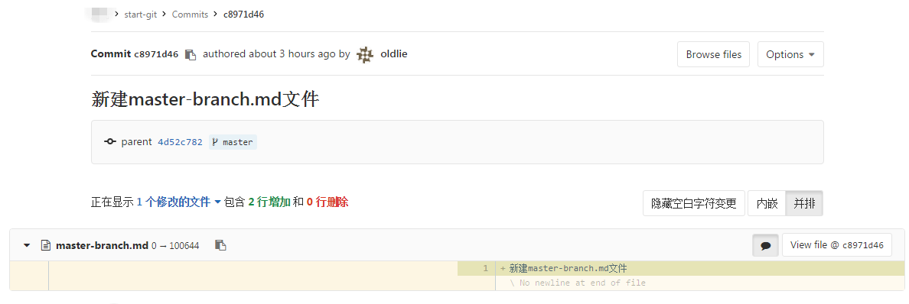

复制上图中的 commit 的唯一ID前8位字符串 “c8971d46 ”，执行```git cherry-pick c8971d46```

可以看到 master-branch.md 文件出现了。检查文件内容，仅拥有此前的修改而没有出现“master 第一次修改”字样。说明已经正确的将特定版本迁出到 dev 分支。

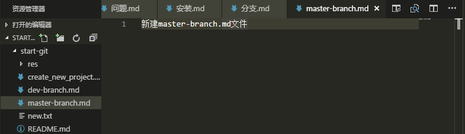

## 合并分别演进的 dev 和 master 分支，并解决冲突

执行 ```git branch``` 查看当前分支是否是 dev，如果不是切换到 dev 分支

修改 master-branch.md  文件如下

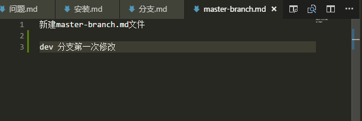

提交修改到远程库

```bash
git add -u
git commit -m "dev 第一次修改master-branch.md文件"
git push origin dev
```

查看 GitLab 上的分支图

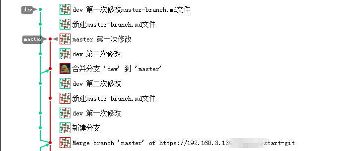

显然现在 dev 和 master 分支同时修改了 master-branch.md 文件。这里尝试使用本地命令将 dev 所有修改合并到 master 分支。

```bash
# 切换分支到 master
git checkout master

# 将 dev 合并到 master
git merge dev
```

出现如下提示

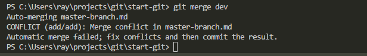

使用 VSCode 打开冲突文件如下

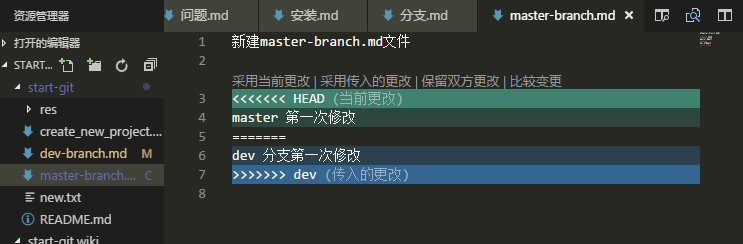

这里点击 “保留双方更改” 结果如下

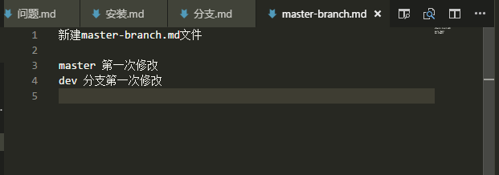

将工作区的 master 修改提交到远程库

执行 ```git status``` 如下图所示，dev 分支最新修改的 dev-branch.md (第三次修改) 合并到了当前 master 分区需要 commit 。以及同事修改的 master-branch.md 文件需要添加到暂存区

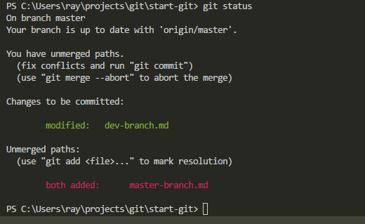

按照上图提示执行以下命令
```bash
git add -A
git commit -m "master 合并 dev"
git push origin master
```

检查 GitLab 上的分支图，可以看到 dev 和 master 已经合并了。

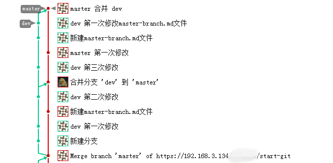

此时，如果开发工作已经完成，不需要再演进新的版本了则可以删除 dev 分支 ```git branch -d dev```。

以上，分支的基础操作就完成了。
