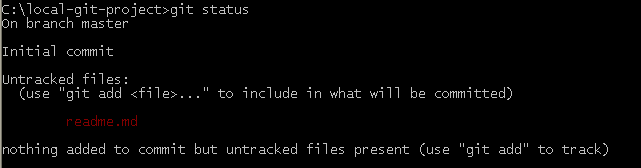
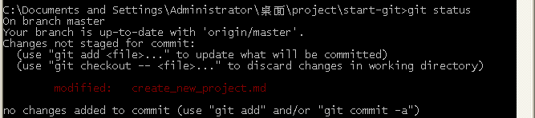
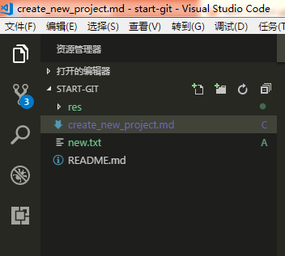

# 使用GIT

## 本地环境设置

在命令行中分别执行
```bash
git config --global user.name "xxx"
git config --global user.email "git@cnipr.com"
git config --global http.sslVerify "false"
```

## GIT 概要流程


## 从本地计算机开始新建

1.打开命令行

2.新建项目目录 ```mkdir local-git-project```

3.跳转到目录 ```cd  local-git-project```

4.执行```git init```

5.在目录下新建一个```readme.md```文件

6.执行```git status```命令,红色表示文件还没被```GIT```监测 



7.将文件添加到```Index(暂存区)```执行```git add -A```命令

8.再次执行```git status```命令,绿色表示已经添加到了```Index(暂存区)``` 

  
 
 > [去了解](https://www.cnblogs.com/skura23/p/5859243.html)```git add .```，```git add -u```和```git add -A```的区别

9.执行```git commit -m "init project"```将```Index(暂存区)```修改提交到本地```Repository(版本库)``` 

10.再次执行```git status```命令，如图显示所有修改都已经提交到```Repository(版本库)``` 

到这里本地版本控制完成。

## 添加到远程库(Remote)

1.    登录[GitLab](https://192.168.3.134/)

1.    新建一个项目

      

1.    填写必要信息

       
        
        因为是内部使用，可见等级最好是Public的。

1.      

1.    这时你会发现，这个页面已经给出了如何添加远程库的提示 

      

1.    回到```local-git-project```文件夹

1.    执行```git remote add origin https://192.168.3.134/xxx/start-git.git```

1.    执行```git push origin master``` 

       
        过程中会输入账号和密码。

1.    回到项目网页就可以看到刚刚上传的文件

      

## 在新位置克隆项目

1.    打开要克隆远程库的文件夹 

      

1.    打开远程库网址，并点击复制地址

       

1.    在```project```文件夹中执行```git clone https://192.168.3.134/xxx/start-git.git```

       

1.    打开```start-git```文件夹，此时远程库代码已经复制到本地

## 解决冲突

1.    在上一步新建的项目中修改一个文件

1.    执行```git status```可以看到修改的文件

      

1.    执行```git add -u```添加修改到```暂存区```

1.    执行```git commit -m "update"```将修改提交到本地版本库

1.    执行```git push```将本地库(当前分支)推送到(默认的)远程库

1.    回到最开始新建项目的的文件夹

1.    修改同一个文件

1.    执行```git status```

      
    
1.    执行```git add -A```

1.    执行```git commit -m "解决冲突"```

1.    执行```git pull```拉取远程代码,可以看到冲突代码信息

      

1.    选择一个解决冲突的方案或者手动修改冲突部分

1.    执行```git add -A```
1.    执行```git commit -m "解决完冲突"```
1.    执行```git push origin master```将解决完冲突之后的代码提交到远程库
1.    回到本小节新建的项目文件夹```start-git```
1.    执行```git pull roigin master```将远程库中最新的修改拉取回来可以看到最新修改已经拉取到本地
    
1.    打开之前修改的文件，可以看到文件已经修改到解决冲突之后。


## 已有代码合并到远程库

1.在上一小节新建的文件夹```start-git```中找到```.git```文件夹并且删除。让当前文件夹脱离```git```的版本控制，以便模拟已有的代码和远程库交互

2.新建一个文件```new.txt```，随意修改文件```create_new_project.md```

3.执行```git init```显示如下：


4.执行```git remote add origin https://192.168.3.134/xxx/start-git.git```

5.执行```git status```可以看到本地修改和远程库不一样的文件。


6.执行```git add -A```添加修改到```暂存区```

7.执行```git commit -m "添加已存在的代码"```

8.执行```git push origin master```出现错误


9.按照提示执行```git pull origin master```


10.执行```git status```查看状态


11.打开```both added```的```create_new_project.md```文件。看到里面有冲突部分的提示。通过VSCode工具或者手动修改掉冲突部分

12.执行```git git add -A```将修改后的文件提交到暂存区

13.执行```git commit -m "解决已存在项目的冲突"```

14.执行```git push origin master```

15.回到原始文件夹```local-git-project```

16.执行```git pull origin master```

17.看到如下图所示的冲突，以及```new.txt```的文件




18.解决本地冲突，此时大功告成。


