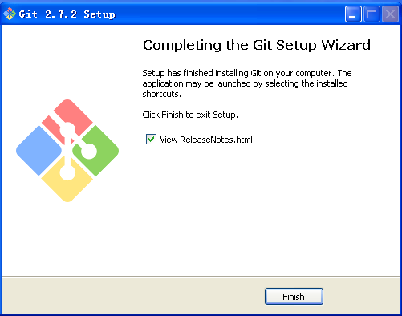

# 开始使用 GIT 

## 安装

Git官网下载window版本：

[Downloading Git](https://git-scm.com/download/win)

> 这个网址极有可能被墙导致下不下来。

通过360软件中心安装

1.    
1.    

下载完毕之后运行


下一步习惯用Linux的可以选第一个选项


这一步是否使用文件缓存，根据自己实际来勾选




验证是否安装好

1.    打开命令行
1.    执行命令```git --version```

出现正确的版本信息即可

