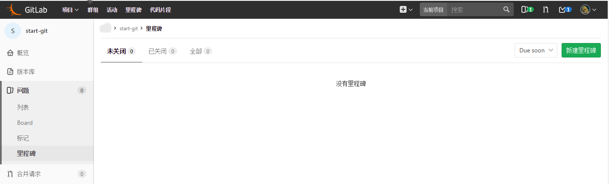
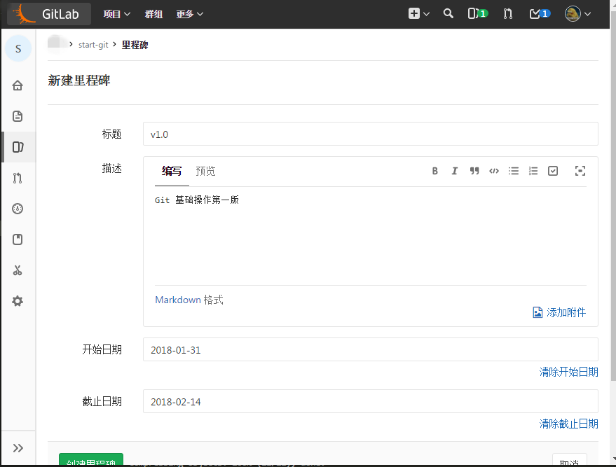
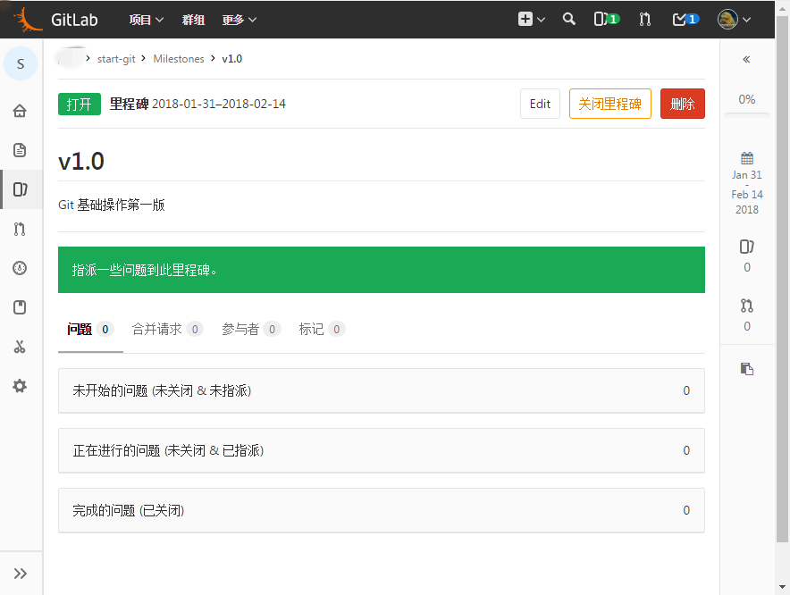
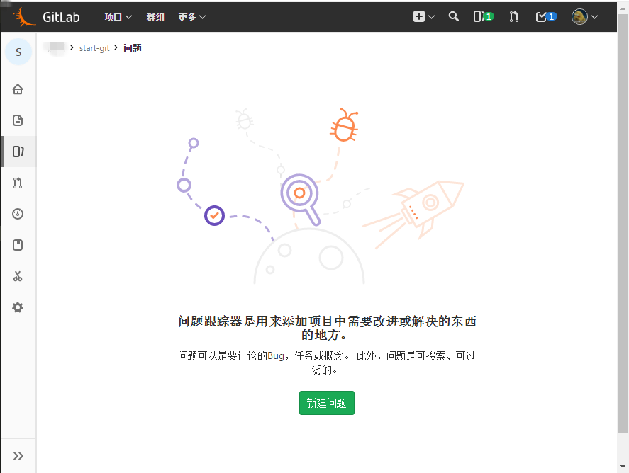
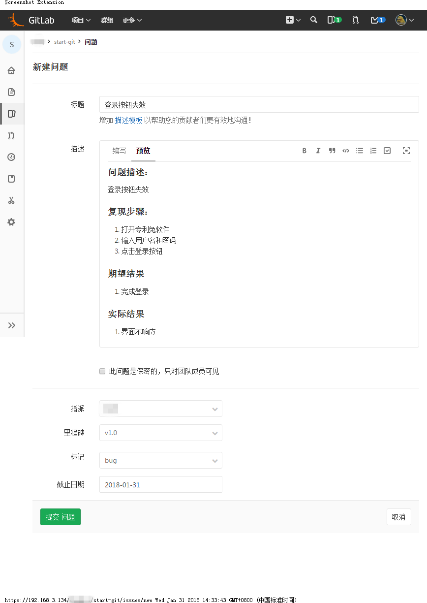
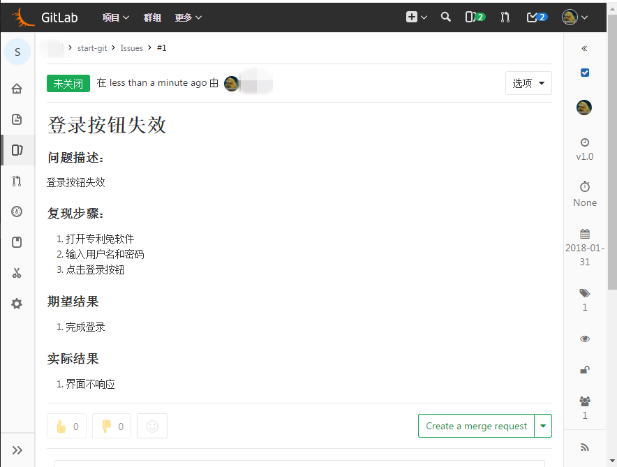
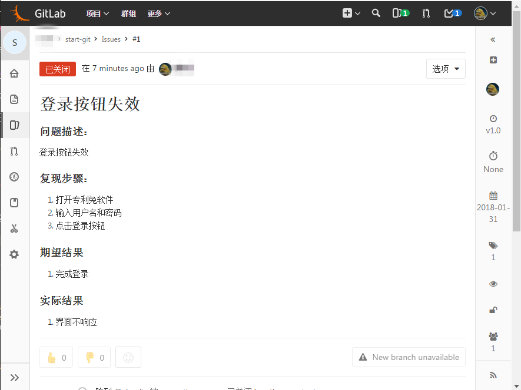

# 问题

## 里程碑

提交问题之前应该先建立对应的里程碑用于项目的管理。里程碑界面如下：



设置好里程碑信息之后点击 创建里程碑



可以看到里程碑的管理界面。



从上图可以看出，针对特定版本的问题，使用里程碑管理很方便。

新建完成 里程碑 之后，就可以开始新建问题了。因为默认的 标记 已经基本涵盖了常用的问题形式，这里不再演示修改。

点击下图的“新建问题”按钮

8

填写好问题的相关选项



> 如果是bug类的问题，请务必填写“里程碑”。

点击“提交问题”按钮提交问题



编号为 #1 的问题已经创建了。

假设这个问题在当前工作区已经修改，执行如下命令

```bash
# 添加当前所有的修改到“暂存区”
git add -A
git commit -m "fixed #1 修复了登录按钮失效的问题"
git push origin master
```

回到问题网页，可以发现这个问题已经被刚刚的 commit 关闭了。


